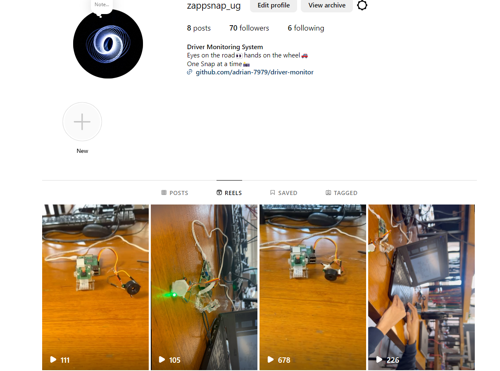

# Driver Monitor System
## Introduction
A Driver Monitor System github page, developed by Adrian Dsilva, Vibhav Madhusudhan, Hamirdhavalle Dhandapani Vijaya and Ohemaa Adebi Bawuah.

As part of Real Time Embedded Programming course at the University of Glasgow. The main task is to develop a project that calls for real time programming under GNU/Linux on a Raspberry Pi. 

The project we settled on is a robust Driver Monitoring system . The system aims to prevent drowsy or unconscious driving. By utilizing a camera system, it continously analyzes the driver's eye state and triggers an alert sound sensing if the driver is asleep or unconscious. This idealogy is carried out through recording the number of consecutive frames trhough a 5MP camera, in which the eyes are identified(detected) using `libopencv-dev` `libcamera-dev`. An alert sound note is played through Raspberry Pi's AUX port using ALSA(Advanced Linux Sound Architecture) ensuring the driver is notified promptly. Furthermore, a relay is also connected in parallel to trigger the e-call system switch of the vehicle incase of the eyes not identited for more than a specific number of consecutive frames captured.

This git repository contains the code required to run this project and instructions on how to build it for both hardware and software.


## Acknowledgements
We would like to thank Bernd Porr for his contribution to the "libcamera2opencv".
The original code can be found at [github.com/berndporr/libcamera2opencv](github.com/berndporr/libcamera2opencv) 

We would also like to thank Nash for his contribution to the eye tracking code.
The original code can be found at [github.com/bsdnoobz/opencv-code/blob/master/eye-tracking.cpp](github.com/bsdnoobz/opencv-code/blob/master/eye-tracking.cpp) 

We would also like to thank Alessandro Ghedini for his contribution to the sound file player code.
The original code can be found at [https://gist.github.com/ghedo/963382](https://gist.github.com/ghedo/963382)

The contributors to this repository are [Vibhav Madhusudan](https://github.com/vibhavmadhusudhan99), [Hamirdhavalle DV](https://github.com/Hamirdhavalle-dv), [Adebibawuah](https://github.com/Adebibawuah) and [Adrian Dsilva](https://github.com/adrian-7979)

## Documentation
The workflow of this project is described in [Driver Monitoring System Documentation](./eye-monitor/Documentation.md)

The TaskBoard of the project can be found in the Projects tab of this repository.

## Software
### Prerequisties/Dependencies

```
apt install libopencv-dev libcamera-dev
```

This program also uses ALSA to play the alarm sound.
```
sudo apt-get install libasound2-dev
```
Additionally, pigpio also has to be downloaded from [here](https://abyz.me.uk/rpi/pigpio/index.html), for all GPIO functions. 

The following packages are recommended
* `git` for cloning repository or you can download the code from the GitHub directly.
* `doxygen` for creating nice documentation from the comments in the code.
These packages can be installed using `sudo apt install <package name>`.

### Software Build
Follow the instructions to build the software,

### Compilation and installation

```
* `cmake ..`
* `make`
sudo make install
```

### Output File
The output file "eye" is in the subdirectory "eye-monitor",  could me made to run in the Linux terminal with the following command, after changing the directory to "eye-monitor"
```
cd eye-monitor
sudo ./eye
```
The output file can also be made to run at start-up using instructions shown [here](https://www.tutorialspoint.com/run-a-script-on-startup-in-linux#:~:text=Make%20the%20script%20file%20executable,scriptname%20defaults"%20in%20the%20terminal.)

## Hardware

This section comprises the hardware components used for the project describing individual purposes. Supporting images for connectivity reference can be found in the following "Hardware components Assembly" sub-section.

### Components
The following components were used for the project.

* Raspberry pi

* Electronic Buzzer- 3-24V piezoelectric buzzer 87dB for physical circuits continuous sound electronic buzzer alarm with cable length 100mm

* FREENOVE 5MP Camera for Raspberry Pi 5 / 4B / 3B+ / 3B / 3A+ / 2B / 1B+ / 1A+ / - Zero W/Zero with Adjustable Holder and Ribbon Cable, 62° Viewing Angle, 1080P 720P Output3.

* 5mm Stereo Jack Audio Aux cable - Used for connecting to vehicle speaker for alert sound.

* Green and Red LED - for indication of eye movement with Forward voltage < 3.3V.

* 150ohm resistor - Used for LED current limitation

#### **Optional**
* 3.3V Relay -  for connecting with e-Call system incase of emergency.

### Hardware Assembly

This image represents the block diagram of the project idea:


This image shows pin configuration on the Raspberry Pi for assembly:


**`Note: For demenostration purposes, red LED was utilized in the hardware setup in place of relay.`**

### Social media links:
We have shared project updates and progress in [Instagram](https://www.instagram.com/zappsnap_ug/]

We posted the working and testing of our project setup summarizing our aim and purpose for this developement. 
Instagram Page: 


Setup Testing on Instagram:
[Testing video](./materials/)
